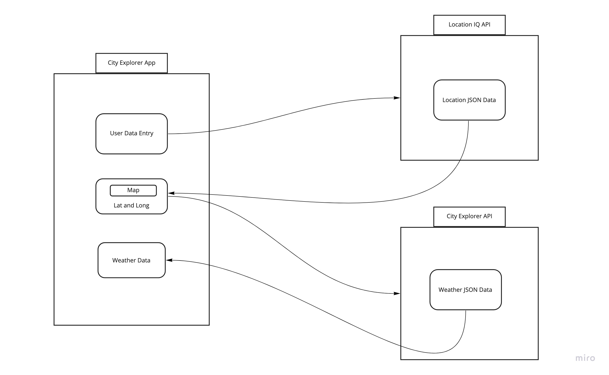

# City Explorer API

**Author**: Beau Hibbert
**Version**: 1.5.0 (increment the patch/fix version number if you make more commits past your first submission)

## Overview

This is a front end application that allows users to search for a city and get back related weather and movie data in order to find out more about the city.

## Getting Started

A user would have to start by cloning a repository down from Github. They would then need to run ```npm i``` to install all necessary npm packages. Next, they would need to obtain a weatherbit api key and add it to their .env file. Lastly they would need to run ```npm start``` in order to run their server.

## Architecture

The project is built using React/Javascript for its frontend, and node/express for its backend. The application is styled using scss. The client makes requests to custom routes on the backend's server which makes requests to weatherbit and locationIQ APIs.

## Change Log

12/7/21 - Scaffolding
12/8/21 - /weather endpoint now making successful API requests to locationIQ and weatherbit
12/9/21 - Add /movie route and query movieDB API
12/12/21 - Added caching functionality for movie and weather data to make for a faster user experience.

## Credit and Collaborations
https://locationiq.com/
https://www.weatherbit.io/
https://www.themoviedb.org/?language=en-US


Name of feature: Custom Servers with Node and Express

Estimate of time needed to complete: 4 hours

Start time: 4

Finish time: still not done

Actual time needed to complete: tbd



